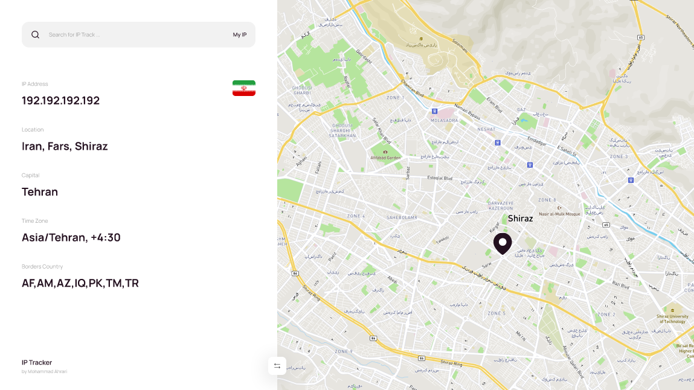

# IP-Tracker

This is an IP tracker project



Search your IP and find your location on the map

This project is made by react js and tailwind and Leaflet library is used to create the map

# Usage

```

git clone https://github.com/mohammad-moa/IP-Tracker.git

cd IP-Tracker

npm install

npm run dev

```
